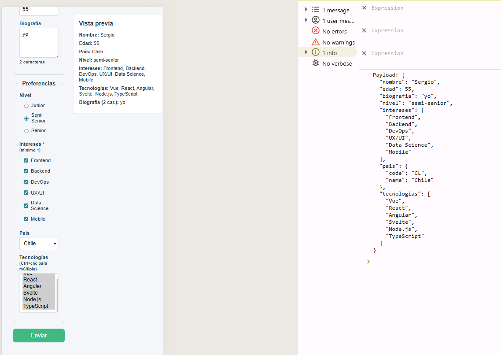
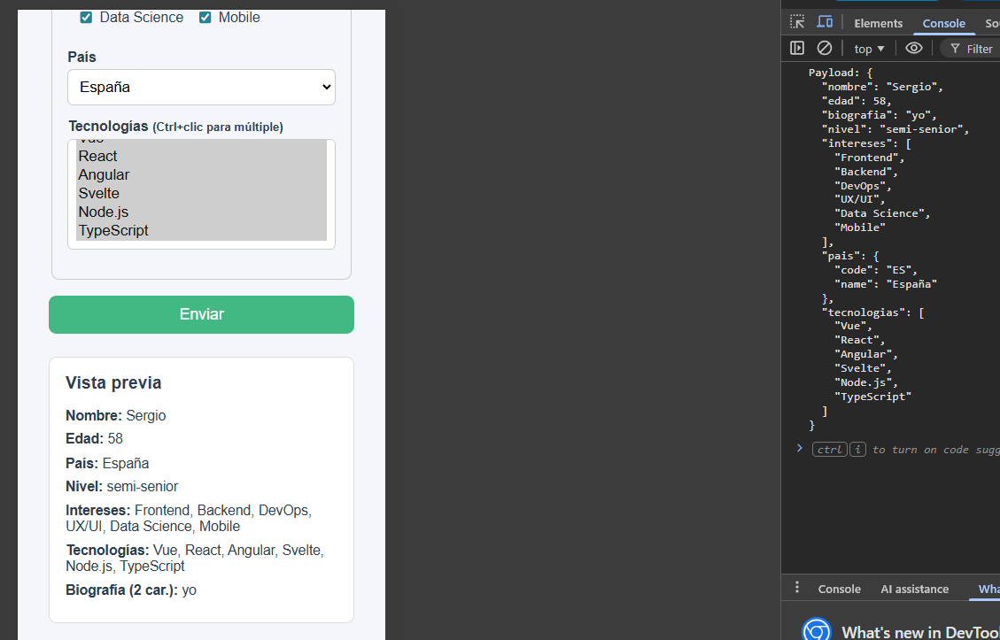

# 📋 Registro / Perfil — Ejercicio 4 · Módulo 6

Aplicación SPA desarrollada con **Vue 3** que implementa un formulario de registro/perfil completo con validación reactiva en tiempo real, vista previa dinámica y modal de confirmación.

---

## 🚀 Demo de características

| Característica | Descripción |
|---|---|
| **Formulario multi-sección** | Datos básicos y preferencias organizados en fieldsets |
| **Validación reactiva** | Errores calculados con `computed` sin librerías externas |
| **Vista previa en tiempo real** | Panel lateral (`aside`) sincronizado con el estado del formulario |
| **Modal de confirmación** | Muestra el payload JSON al enviar correctamente |
| **Diseño responsivo** | Layout de dos columnas que colapsa en móvil (`≤ 640 px`) |

---

## 🛠️ Tecnologías

- [Vue 3](https://vuejs.org/) `^3.2`
- [Vue CLI](https://cli.vuejs.org/) `~5.0`
- Babel · ESLint

---

## ⚙️ Instalación y uso

### 1. Clonar el repositorio e instalar dependencias

```bash
npm install
```

### 2. Servidor de desarrollo con hot-reload

```bash
npm run serve
```

Abre [http://localhost:8080](http://localhost:8080) en el navegador.

### 3. Build de producción

```bash
npm run build
```

Los archivos optimizados se generan en la carpeta `dist/`.

### 4. Lint y corrección automática

```bash
npm run lint
```

---

## 📁 Estructura del proyecto

```
src/
└── App.vue        # Componente raíz: formulario, validación, resumen y modal
public/
└── index.html     # Entrada HTML
```

---

## 🧩 Conceptos de Vue practicados

- `v-model` con modificadores: `.trim`, `.number`, `.lazy`
- `v-model` en `checkbox`, `radio` y `select` múltiple
- Propiedades `computed` para validación y estado del formulario
- Directivas `v-if`, `v-for` y binding de clases dinámicas (`:class`)
- Manejo de eventos con `@submit.prevent` y `@click.self`

---

## 📸 Capturas

| Formulario | Confirmación |
|---|---|
|  |  |

---

## 📄 Configuración adicional

Consulta la [Referencia de configuración de Vue CLI](https://cli.vuejs.org/config/) para opciones avanzadas.
